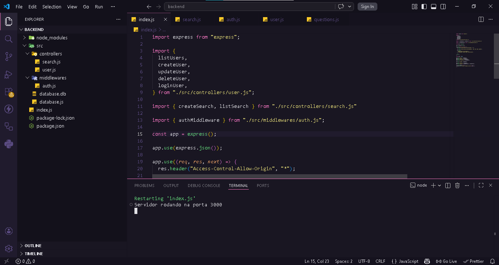

# Find - Sistema de Localização de Pets

  

>

O **Find** é uma aplicação Full Stack desenvolvida para ajudar na divulgação e busca de animais perdidos. O projeto permite que usuários se cadastrem, façam login com segurança e gerenciem anúncios de pets encontrados ou desaparecidos.

## 🚀 Tecnologias Utilizadas

### Frontend

- **HTML5 & CSS3:** Estrutura e estilização moderna com variáveis CSS.
- **JavaScript (ES6+):** Manipulação de DOM, Fetch API e módulos.
- **Toastify:** Sistema de notificações personalizadas para feedback do usuário.

### Backend

- **Node.js & Express:** Ambiente de execução e framework para a API.
- **JWT (JSON Web Token):** Autenticação segura de rotas.
- **Bcrypt:** Criptografia de senhas para segurança do banco de dados.
- **SQLite:** Banco de dados relacional leve e eficiente.
- **Multer:** Middleware para upload e gerenciamento de imagens.
- **Dotenv:** Gerenciamento de variáveis de ambiente.

## Funcionalidades

* Cadastro e Login: Com validação de credenciais e senhas criptografadas.
* Proteção de Rotas: Apenas usuários logados (com Token válido) podem criar ou deletar anúncios.
* Upload de Fotos: Sistema integrado para envio de fotos dos pets.
* Feedback Visual: Notificações de sucesso/erro via Toasts e mudança de estado nos botões.

### Pré-requisitos

- Possuir o **Node.js** instalado em sua máquina.

### Como acessar e utilizar o Find:

- Na página inicial do projeto, para criar a conta clique no botão "Participar da Comunidade" -- Para acessar sua conta clique no botão de entrar com seu email e senha cadastrados.

### Acessar como recrutador

- Na página de Login e Registro existe um botão "Acessar como Recrutador", se estiver na página de Registro irá ser direcionado para página de Login, onde o botão agora fara o Login automático.
